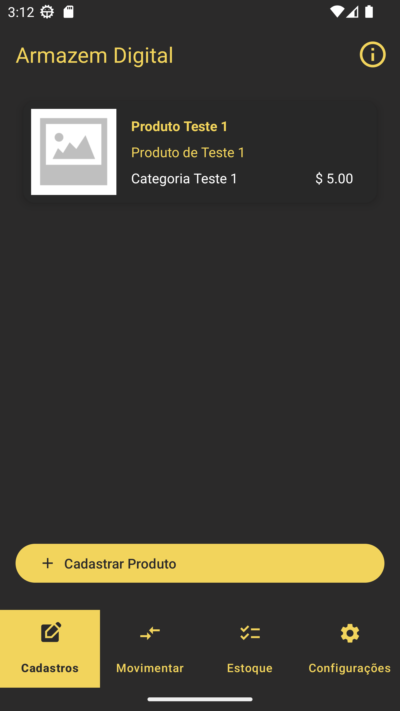
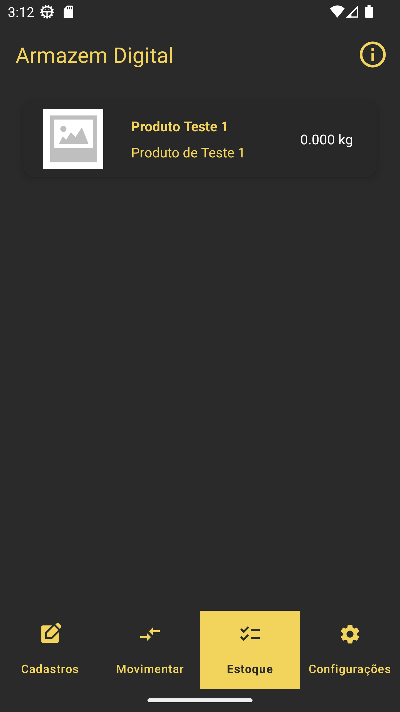
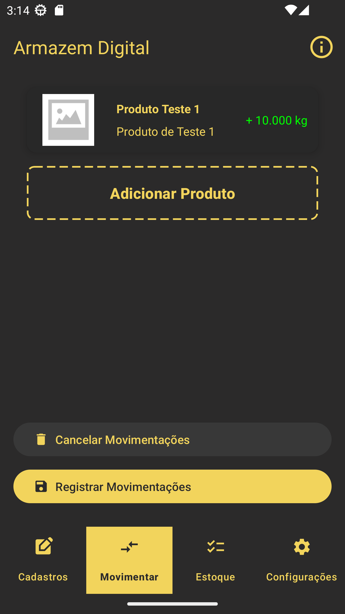
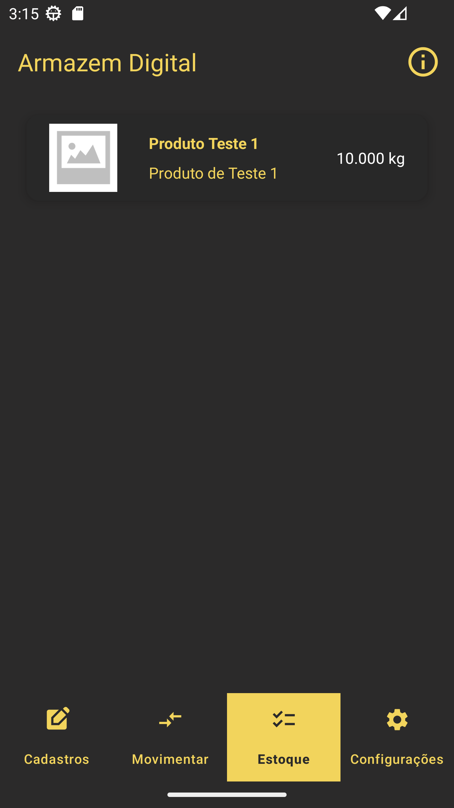

Native Android application for inventory management, developed as a final graduation project (TCC).  
It provides full control over products, categories, and suppliers, with a focus on organization, performance, and scalable architecture.

🔗 **GitHub:** [View Repository](https://github.com/thiago-fullenbach/armazemdigital)

### 🚀 Main Features
- Product, category, and supplier management  
- Stock control and item movement  
- Real-time data editing and visualization  

### 🏗️ Architecture & Tech
- **Architecture:** MVVM  
- **Language:** Java  
- **Platform:** Android (Views)  
- **Persistence:** SQLite (Room)  
- **Practices:** clean separation of concerns, modular structure  

### 🧪 Quality
- Unit tests with JUnit and Mockito  
- Instrumented tests with Espresso  
- CI/CD with GitHub Actions  

### 📱 Screenshots

  
  
  
  

