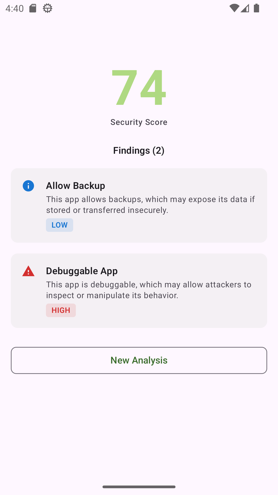

Android application focused on static analysis of APK files to detect security risks and misconfigurations.
Designed to help developers and security-conscious users understand potential vulnerabilities before installing or distributing apps.

🔗 **GitHub:** [View Repository](https://github.com/thiago-fullenbach/droiddissect)

### 🚀 Features
- APK static analysis (local or installed files)
- Detection of common security misconfigurations:
  - `allowBackup` enabled
  - `debuggable` flag active
  - `usesCleartextTraffic` (HTTP allowed)
- Risk-based classification of findings
- Local history of analyses using database persistence
- Modern Android UI built with Jetpack Compose (Material 3)

### 🏗️ Architecture & Tech

- Kotlin
- Jetpack Compose (Material 3)
- Hilt (Dependency Injection)
- Room (local persistence)
- Coroutines & Flow (async/reactive handling)
- Timber (logging)
- Firebase Crashlytics

### ⚙️ Highlights
- Modular analyzer design allowing easy addition of new security checkers
- Clear separation between domain logic and UI layers
- Local-first approach with offline capability
- Scalable structure for future expansion (permissions, components, deeper APK inspection)
- Designed with real-world security analysis concepts in mind

### 🔮 Future Improvements
- Expand analyzer with new checks (permissions, exported components, intent filters)
- Introduce scoring system for overall APK security rating
- CI/CD pipeline for automated testing and delivery
- Exportable reports (PDF/JSON)

### 📱 UI Preview

  

