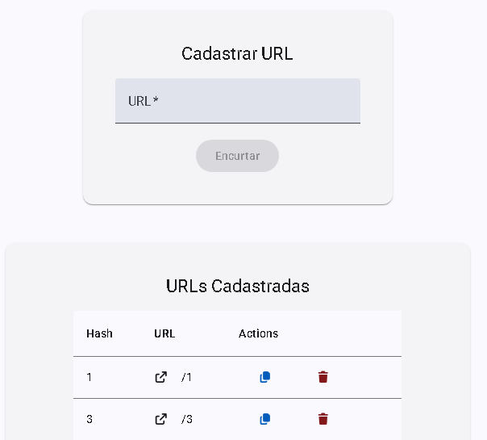

Fullstack application for URL shortening, composed of an Angular frontend and a Spring Boot backend.  
Designed with a layered architecture, containerization, and real-world API design in mind.

🔗 **Frontend:** [View Repository](https://github.com/thiago-fullenbach/vaila-frontend)  
🔗 **Backend:** [View Repository](https://github.com/thiago-fullenbach/vaila-backend)

### 🚀 Features
- Create, list, and delete shortened URLs  
- Redirect using Base62-encoded hashes  
- Paginated API responses  
- Validation and structured error handling  

### 🏗️ Architecture & Tech

**Frontend**
- Angular 20, Angular Material  
- Tailwind CSS  
- Docker + Nginx  

**Backend**
- Java 21, Spring Boot  
- Spring Web, Spring Data JPA  
- PostgreSQL / H2  
- MapStruct, Lombok  

### ⚙️ Highlights
- Layered architecture (Controller, Service, Repository, DTO, Mapper)  
- Base62 encoding for short URL generation  
- Environment-based configuration (dev, test, prod)  
- Containerized with Docker Compose  

### 📱 UI Preview

  

